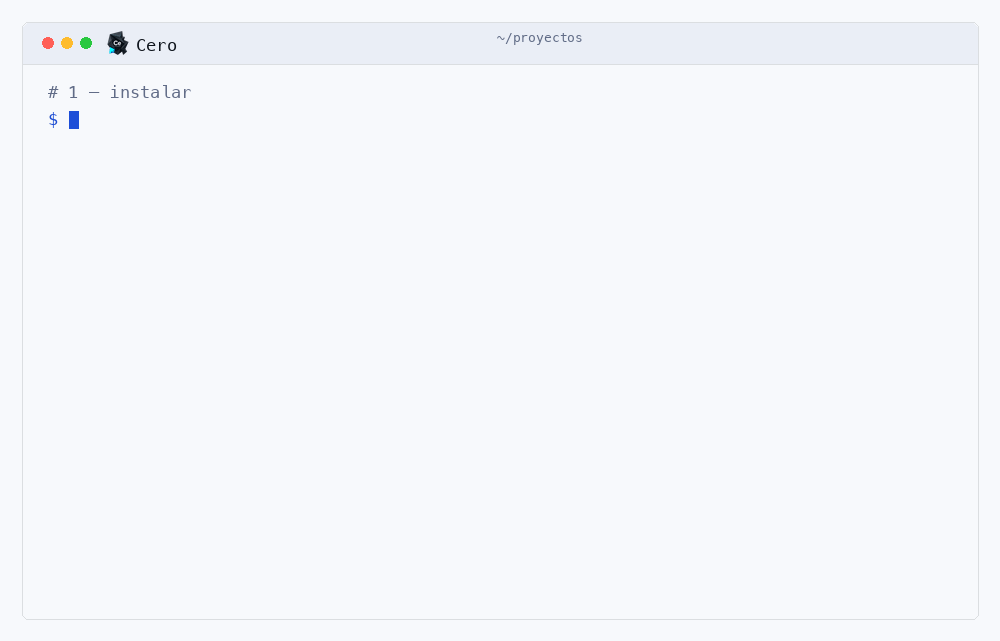

# Cero

Framework web para Java que arranca solo, sin contenedor de servlets y sin una sola dependencia
externa. Pensado desde el principio para vivir en más de un lenguaje.

[](https://central.sonatype.com/namespace/dev.ginit.cero)
[](https://openjdk.org/)
[](#principios)
[](#estado)
[](LICENSE)
[](https://cero.ginit.dev)

> [!NOTE]
> **English** — Cero is a web framework for Java 25 with its own HTTP server, one virtual
> thread per connection and zero runtime dependencies. The full documentation is available in
> English at **[cero.ginit.dev/en](https://cero.ginit.dev/en)**; this repository, its commit
> history and the javadoc are written in Spanish, which is deliberate.

**En producción:** [cero.ginit.dev](https://cero.ginit.dev) — el sitio de este proyecto,
servido por el propio framework, sin Tomcat detrás. Su código está abierto en
[`cero-sitio`](https://github.com/Andre031222/cero-sitio): React con Vite delante, Cero detrás,
los dos dentro del mismo jar. Es la aplicación de ejemplo más completa que hay, y se puede
comprobar que la afirmación de arriba es cierta en vez de creerla.


* * *

## Qué es

Cero sale de una molestia concreta: desplegar una aplicación Java suponía montar un contenedor de
servlets, empaquetar un WAR, copiarlo a Tomcat y confiar en que la configuración del servidor
fuera la que uno creía. Nada de eso es el programa que uno escribió.

De ahí las dos decisiones que definen el proyecto:

1. **Arranca solo.** Servidor HTTP/1.1 y HTTP/2 propio, con un hilo virtual por conexión. `java -jar app.jar`
   y está corriendo: sin contenedor de servlets, sin `web.xml`, sin despliegue.
2. **No es solo Java.** El objetivo final es un *contrato* de framework —rutas, pipeline,
   request/response, inyección, configuración— definido de forma neutral e implementado en
   **Java, Rust y C++**, con un mismo banco de conformidad para los tres.

## Principios

- **Cero dependencias en ejecución.** Solo el JDK. El driver JDBC lo pone la aplicación, y es la
  única excepción.
- **Legible antes que ingenioso.** Si una clase no se puede leer de corrido, se parte.
- **Medido, no proclamado.** Toda afirmación de rendimiento sale de [`benchmarks/`](benchmarks/),
  con el mismo harness para todos los contendientes.
- **El contrato manda.** Desde la fase 3 ninguna implementación es la de referencia: la referencia
  es `spec/`, y las tres pasan las mismas pruebas.

## Rendimiento

*Contenedores idénticos, misma corrida, 90 mediciones sin un solo error. **Medición de agosto de
2026, sobre Cero 0.6.0**: se sustituirá en cuanto haya corrida nueva.
[Cómo se rehace](benchmarks/results/LEEME.md).*

| Framework | Arranque | Imagen | RSS | rps `/plaintext` | rps `/json` | rps `/db` |
|---|---|---|---|---|---|---|
| **Cero** | **106 ms** | 110,3 MB | **136,4 MB** | **26 425** | **25 431** | **25 931** |
| Javalin | 451 ms | 115,2 MB | 285,7 MB | 21 994 | 25 125 | 24 459 |
| Quarkus | 707 ms | 123,2 MB | 259,8 MB | 25 515 | 22 744 | 21 258 |
| Micronaut | 838 ms | 120,7 MB | 201,2 MB | 18 381 | 19 088 | 17 213 |
| Spring Boot | 1467 ms | 127,3 MB | 352,5 MB | 19 809 | 20 432 | 20 088 |

Cero gana en todo menos en tamaño de imagen, donde queda segundo. Arranca 4,3× más rápido que el
siguiente, gasta la menor memoria de la tabla y lidera los tres endpoints. La ventaja mayor está
en el arranque; en `/db` —el que mide el framework haciendo trabajo de aplicación— la diferencia
con el segundo es del 6 %.

> [!WARNING]
> **Se midió en Docker Desktop.** Los valores **relativos** son justos, porque las condiciones
> fueron idénticas para los cinco; los **absolutos** hay que repetirlos en Linux sin virtualizar
> antes de citarlos en ningún sitio.

## Instalar

Java 25 o superior (hilos virtuales) y Maven. Nada más.

Está en Maven Central. Tres líneas y ya está:

```xml
<dependency>
    <groupId>dev.ginit.cero</groupId>
    <artifactId>cero-core</artifactId>   <!-- arrastra cero-http -->
    <version>0.7.0</version>
</dependency>
```

`cero-view`, `cero-data`, `cero-test`, `cero-adapter-servlet` y `cero-launcher` van aparte, y se toman solo si
se usan. Ninguno arrastra nada de fuera.

### El instalador

Sirve para tener la orden `cero`, que es la que crea proyectos ya montados.

<picture>
  <source media="(prefers-color-scheme: dark)" srcset="docs/imagenes/instalar.gif">
  
</picture>

```bash
curl -fsSL https://cero.ginit.dev/instalar | sh          # macOS y Linux
irm https://cero.ginit.dev/instalar.ps1 | iex            # Windows (PowerShell)
```

Baja el paquete, comprueba su `sha256`, lo compila, deja los artefactos en tu `~/.m2` y te pone la
orden `cero` en el PATH. No pide contraseña y no escribe fuera de tu carpeta personal. Los dos
guiones se sirven como texto plano a propósito —[instalar](https://cero.ginit.dev/instalar) ·
[instalar.ps1](https://cero.ginit.dev/instalar.ps1)— para que puedas leerlos antes de ejecutarlos.

Después:

```bash
cero new mi-app
cd mi-app && mvn -q package && java -jar target/mi-app.jar
```

Y desde el código fuente, que es lo mismo paso a paso:

```bash
git clone https://github.com/Andre031222/Cero.git && cd Cero
cd java && mvn install     # 1 762 pruebas, runner propio (sin JUnit)
./cero fatjar ejemplo       # un solo jar: java -jar ejemplo.jar
```

<details>
<summary>Las pruebas contra PostgreSQL y MySQL reales, si las quieres correr</summary>

<br>

`cero-data` corre su batería contra motores de verdad. Sin ellos escuchando se omiten esos grupos
y el resto sigue:

```bash
docker run -d --name cero-pg -e POSTGRES_PASSWORD=cero -e POSTGRES_DB=ceropruebas \
       -p 55432:5432 postgres:16-alpine
docker run -d --name cero-my -e MYSQL_ROOT_PASSWORD=cero -e MYSQL_DATABASE=ceropruebas \
       -p 53306:3306 mysql:8
```

</details>

En [integración continua](.github/workflows/pruebas.yml) se levantan siempre, y la corrida **falla
si algún motor quedó sin probar** — para que la suite no pueda mentir por omisión.

## Un vistazo

```java
@Route("/api")
class ApiController {

    @Inject Catalogo catalogo;

    @Get("/articulos/{id}")
    public Object porId(@Path("id") int id) {
        return catalogo.porId(id);
    }
}

Cero.run(8080, ApiController.class);
```

Eso levanta ruteo, inyección de dependencias, serialización JSON y manejo de errores. De dónde sale
cada argumento se decide **al registrar la ruta**, no en cada petición: el camino caliente no toca
la reflexión.

## Los módulos

| Módulo | Pruebas | Qué trae |
|---|---|---|
| [`cero-http`](java/cero-http) | 432 | Servidor HTTP/1.1 y HTTP/2 con un hilo virtual por conexión: keep-alive, chunked, `Expect: 100-continue`, TLS recargable sin reiniciar, cookies, sesiones con rotación de identificador y almacén enchufable, multipart, gzip, estáticos con `Range`, `Cache-Control` y respaldo para aplicaciones de una sola página, **WebSocket** (RFC 6455), **eventos del servidor** (SSE), **HTTP/2** —h2c y h2 sobre TLS por ALPN— y confianza en proxy configurable |
| [`cero-core`](java/cero-core) | 834 | Router, pipeline con middleware, inyección con detección de ciclos, JSON propio, vinculación de parámetros, clase base de controlador **opcional**, CORS, CSRF, rate limiting, validación, cabeceras de seguridad, métricas, logs, OAuth 2.0 con PKCE, PBKDF2, caché, eventos, tareas en segundo plano con cron, **correo SMTP**, **trazado W3C** y OpenAPI |
| [`cero-view`](java/cero-view) | 93 | Motor de plantillas propio: `{{ expr }}` escapado por defecto, ``, ``, herencia con `` y `` |
| [`cero-data`](java/cero-data) | 250 | `Row`, `Db`, `Pool`, `Tx`, `Repository<T, ID>`, `JdbcSessions` —sesiones en tabla— y `Migrations` —esquema versionado—. Todo por `PreparedStatement`. La misma batería corre contra **H2, PostgreSQL 16 y MySQL 8 reales** |
| [`cero-test`](java/cero-test) | 29 | Pruebas de punta a punta para quien usa Cero: levanta la aplicación en un puerto libre, cliente HTTP que mantiene las cookies y deja fijar la versión del protocolo, y aserciones legibles sobre la respuesta |
| [`cero-adapter-servlet`](java/cero-adapter-servlet) | 35 | La puerta de salida: la misma aplicación se despliega en Tomcat sin tocar el código, para que migrar sea reversible |
| [`cero-launcher`](java/cero-launcher) | 10 | La línea de órdenes: el generador de `cero new`, el empaquetado en un jar ejecutable con `java.util.jar` y sin plugins de terceros, y las migraciones |
| [`ejemplo`](java/ejemplo) | 79 | Aplicación pequeña de punta a punta: vistas, formularios con CSRF, validación, base de datos y API REST paginada |

Los cuatro del núcleo —`cero-http`, `cero-core`, `cero-view` y `cero-data`— suman **416 KB** y no
declaran ninguna dependencia externa. La única referencia a `jakarta.*` en todo el proyecto está en
`cero-adapter-servlet`, en *scope* `provided`.

## Estado

**Versión 0.7.0**, publicada en Maven Central. El framework está completo en Java y el sitio de
este proyecto corre sobre él.

Lo que cerró la fase 2 no fue una lista de casillas: fue que el framework tuvo su **primer
consumidor externo** y con él la primera auditoría de alguien que no lo escribió — once hallazgos
leyendo el código, dos explotables desde fuera sin credenciales. Los once están cerrados con
prueba propia.

La 0.7.0 salió de una segunda revisión externa, y el hallazgo mayor da la medida de para qué
sirven: **la cookie de sesión no viajaba en ninguna respuesta HTTP/2**. Dos implementaciones
hermanas de la misma interfaz y solo una preguntaba por la cookie pendiente, así que sobre h2
ningún cliente podía iniciar sesión — y sin sesión no hay token CSRF, con lo que toda escritura
respondía 403 señalando al sitio equivocado. Ninguna de las 432 comprobaciones del módulo lo vio,
porque todas entraban por HTTP/1.1: no fue un descuido de escritura, fue un camino de salida
entero sin ejercitar. Ver [versiones.md](docs/versiones.md).

Lo verificado, y cómo:

- **1 762 pruebas** con runner propio, en macOS y en Linux, sobre JDK 25.
- **Bases de datos reales** — la misma batería contra H2, PostgreSQL 16 y MySQL 8.
- **Clientes hostiles** — sockets lentos, cuerpos que mienten, 1000 peticiones simultáneas,
  24 entradas malformadas.
- **23 vectores de conformidad** con RFC 9112, que al escribirse destaparon cuatro incumplimientos.
- **Media hora de carga continua** sin fuga: el RSS acabó más bajo que al empezar y los
  descriptores no se movieron.

Lo que falta está en [docs/produccion.md](docs/produccion.md), sin adornos. Cómo se publica una
versión, en [docs/publicar.md](docs/publicar.md).

> [!IMPORTANT]
> **Nadie lo ha usado en producción con tráfico real durante meses**, y eso no se arregla
> programando. El parser HTTP es la superficie que da a internet y la que más castigo recibe:
> hasta que no acumule kilómetros, no es honesto llamarlo maduro.

Lo siguiente es la **fase 3**: el contrato neutral en `spec/` y las implementaciones en Rust y C++.

## Estructura

```text
java/         Los ocho módulos
benchmarks/   Harness comparativo y prueba de carga sostenida
docs/         Documentación
spec/         Contrato del kernel, neutral respecto al lenguaje   (fase 3)
rust/  cpp/   Implementaciones adicionales                        (fase 3)
cero         Órdenes del proyecto: ./cero test, new, fatjar…
```

## Documentación

| Documento | Qué responde |
|---|---|
| [produccion.md](docs/produccion.md) | ¿Está listo para producción? (respuesta corta: todavía no, y ahí está la lista) |
| [arquitectura.md](docs/arquitectura.md) | El diseño y las tres fases |
| [auditoria-2026-08-01.md](docs/auditoria-2026-08-01.md) | Auditoría interna del núcleo, capa por capa |
| [versiones.md](docs/versiones.md) | Qué cambió en cada versión, y por qué una publicada no se toca |
| [papers.md](docs/papers.md) | Plan de publicación: los tres artículos y qué bloquea cada uno |
| [autores.md](docs/autores.md) | Autoría y atribución |

## Licencia

Apache 2.0 — ver [LICENSE](LICENSE) y [NOTICE](NOTICE).

Autores: **Richar Andre Vilca-Solorzano** y **Ramiro Pedro Laura-Murillo**.
Universidad Nacional del Altiplano, Puno, Perú.

```bibtex
@software{vilcasolorzano2026cero,
  title  = {Cero: núcleo de framework web poliglota sin dependencias},
  author = {Vilca-Solorzano, Richar Andre and Laura-Murillo, Ramiro Pedro},
  year   = {2026},
  url    = {https://github.com/Andre031222/Cero}
}
```
