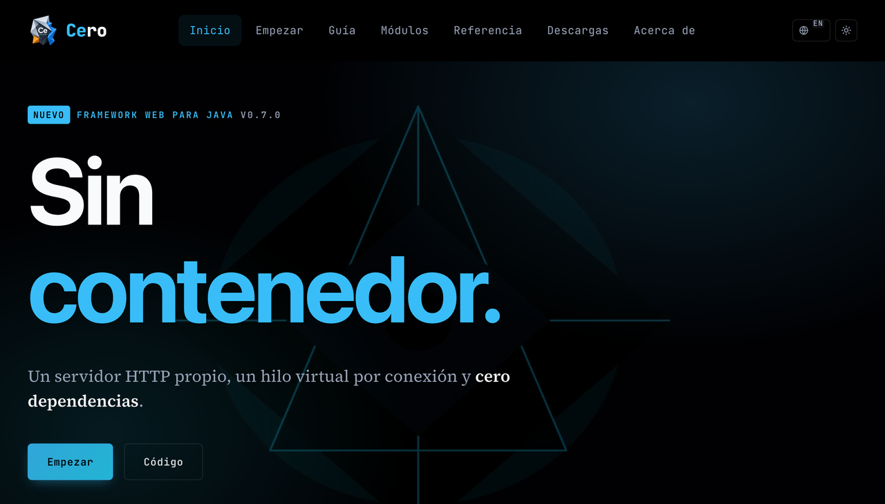
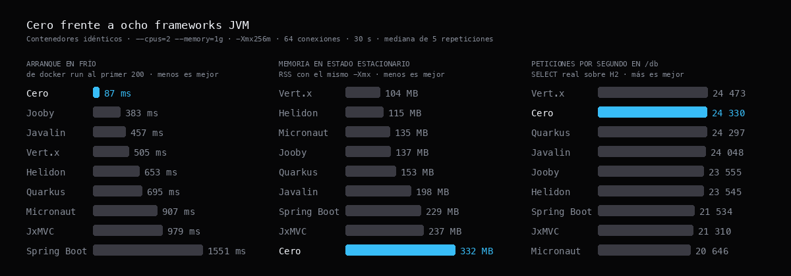
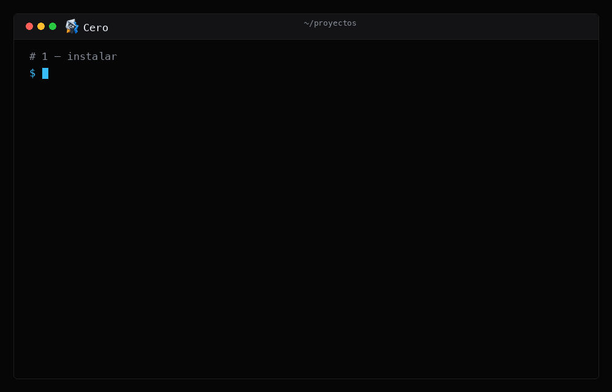

# Cero

Framework web para Java que arranca solo, sin contenedor de servlets y sin una sola dependencia
externa. Pensado desde el principio para vivir en más de un lenguaje.

[](LICENSE)
[](https://openjdk.org/)
[](#principios)
[](#estado)
[](docs/versiones.md)
[](https://cero.ginit.dev)

> **English** — Cero is a web framework for Java 25 with its own HTTP server, one virtual
> thread per connection and zero runtime dependencies. The full documentation is available in
> English at **[cero.ginit.dev/en](https://cero.ginit.dev/en)**; this repository, its commit
> history and the javadoc are written in Spanish, which is deliberate.

> **Antes se llamó LuxCore y luego Corvo.** *LuxCore* chocaba con un framework PHP del mismo
> entorno; *Corvo* resolvió la confusión pero no decía nada del framework. **Cero** sí: cero
> dependencias, cero configuración, cero contenedor. Si vienes de cualquiera de los dos, la
> conversión es una orden y el guion acepta los dos:
> [`docs/migrar-a-cero.md`](docs/migrar-a-cero.md).

**En producción:** [cero.ginit.dev](https://cero.ginit.dev) — el sitio de este proyecto,
servido por el propio framework, sin Tomcat detrás. Su código está abierto en
[`cero-sitio`](https://github.com/Andre031222/cero-sitio): React con Vite delante, Cero detrás,
los dos dentro del mismo jar. Es la aplicación de ejemplo más completa que hay, y se puede
comprobar que la afirmación de arriba es cierta en vez de creerla.



* * *

## Qué es

Cero nace de [JxMVC 3.4.0](docs/origen.md), un framework MVC en Java con cero dependencias que
funciona y está en producción — pero que necesita Tomcat para arrancar y solo existe para Java.

Cero cambia esas dos cosas:

1. **Arranca solo.** Servidor HTTP/1.1 propio con un hilo virtual por conexión. `java -jar app.jar`
   y está corriendo: sin contenedor de servlets, sin `web.xml`, sin despliegue.
2. **No es solo Java.** El objetivo final es un *contrato* de framework —rutas, pipeline,
   request/response, inyección, configuración— definido de forma neutral e implementado en
   **Java, Rust y C++**, con un mismo banco de conformidad para los tres.

## Principios

- **Cero dependencias en ejecución.** Solo el JDK. El driver JDBC lo pone la aplicación, y es la
  única excepción.
- **Legible antes que ingenioso.** Si una clase no se puede leer de corrido, se parte.
- **Medido, no proclamado.** Toda afirmación de rendimiento sale de [`benchmarks/`](benchmarks/),
  con el mismo harness para todos los contendientes.
- **El contrato manda.** Desde la fase 3 ninguna implementación es la de referencia: la referencia
  es `spec/`, y las tres pasan las mismas pruebas.

## Rendimiento



*Los seis en contenedores idénticos, misma corrida, 90 mediciones sin un solo error.
[Tabla completa y salvedades](benchmarks/results/RESULTS-docker.md).*

| Framework | Arranque | Imagen | RSS | rps `/plaintext` | rps `/json` | rps `/db` |
|---|---|---|---|---|---|---|
| **Cero** | **106 ms** | 110,3 MB | **136,4 MB** | **26 425** | **25 431** | **25 931** |
| Javalin | 451 ms | 115,2 MB | 285,7 MB | 21 994 | 25 125 | 24 459 |
| JxMVC | 698 ms | **110,1 MB** | 191,5 MB | 24 240 | 23 307 | 18 771 |
| Quarkus | 707 ms | 123,2 MB | 259,8 MB | 25 515 | 22 744 | 21 258 |
| Micronaut | 838 ms | 120,7 MB | 201,2 MB | 18 381 | 19 088 | 17 213 |
| Spring Boot | 1467 ms | 127,3 MB | 352,5 MB | 19 809 | 20 432 | 20 088 |

Cero gana en todo menos en tamaño de imagen, y ahí pierde por 0,2 MB. Arranca 4,3× más rápido
que el siguiente, gasta la menor memoria de los seis y lidera los tres endpoints. En `/db` —el que
mide el framework haciendo trabajo de aplicación— saca un 38 % al JxMVC del que viene.

**Salvedad que importa:** se midió en Docker Desktop. Los valores **relativos** son justos porque
las condiciones fueron idénticas para los seis; los **absolutos** requieren repetir la corrida en
Linux sin virtualizar antes de citarse.

## Instalar

Java 25 o superior (hilos virtuales) y Maven. Nada más.



```bash
curl -fsSL https://cero.ginit.dev/instalar | sh          # macOS y Linux
irm https://cero.ginit.dev/instalar.ps1 | iex            # Windows (PowerShell)
```

Baja el paquete, comprueba su `sha256`, lo compila, deja los artefactos en tu `~/.m2` y te pone la
orden `cero` en el PATH. No pide contraseña y no escribe fuera de tu carpeta personal. Los dos
guiones se sirven como texto plano a propósito —[instalar](https://cero.ginit.dev/instalar) ·
[instalar.ps1](https://cero.ginit.dev/instalar.ps1)— para que puedas leerlos antes de ejecutarlos.

Después:

```bash
cero new mi-app
cd mi-app && mvn -q package && java -jar target/mi-app.jar
```

Y desde el código fuente, que es lo mismo paso a paso:

```bash
git clone https://github.com/Andre031222/Cero.git && cd Cero
cd java && mvn install     # 1 835 pruebas, runner propio (sin JUnit)
./cero fatjar ejemplo       # un solo jar: java -jar ejemplo.jar
```

Las pruebas de `cero-data` contra motores reales necesitan PostgreSQL y MySQL escuchando; sin ellos
se omiten esos grupos y el resto sigue corriendo:

```bash
docker run -d --name cero-pg -e POSTGRES_PASSWORD=cero -e POSTGRES_DB=ceropruebas \
       -p 55432:5432 postgres:16-alpine
docker run -d --name cero-my -e MYSQL_ROOT_PASSWORD=cero -e MYSQL_DATABASE=ceropruebas \
       -p 53306:3306 mysql:8
```

En [integración continua](.github/workflows/pruebas.yml) se levantan siempre, y la corrida **falla
si algún motor quedó sin probar** — para que la suite no pueda mentir por omisión.

## Un vistazo

```java
@Route("/api")
class ApiController {

    @Inject Catalogo catalogo;

    @Get("/articulos/{id}")
    public Object porId(@Path("id") int id) {
        return catalogo.porId(id);
    }
}

Lux.run(8080, ApiController.class);
```

Eso levanta ruteo, inyección de dependencias, serialización JSON y manejo de errores. De dónde sale
cada argumento se decide **al registrar la ruta**, no en cada petición: el camino caliente no toca
la reflexión.

## Los módulos

| Módulo | Pruebas | Qué trae |
|---|---|---|
| [`cero-http`](java/cero-http) | 427 | Servidor HTTP/1.1 con un hilo virtual por conexión: keep-alive, chunked, `Expect: 100-continue`, TLS recargable sin reiniciar, cookies, sesiones con rotación de identificador y almacén enchufable, multipart, gzip, estáticos con `Range`, `Cache-Control` y respaldo para aplicaciones de una sola página, **WebSocket** (RFC 6455), **eventos del servidor** (SSE), **HTTP/2** —h2c y h2 sobre TLS por ALPN— y confianza en proxy configurable |
| [`cero-core`](java/cero-core) | 817 | Router, pipeline con middleware, inyección con detección de ciclos, JSON propio, vinculación de parámetros, clase base de controlador **opcional**, CORS, CSRF, rate limiting, validación, cabeceras de seguridad, métricas, logs, OAuth 2.0 con PKCE, PBKDF2, caché, eventos, tareas en segundo plano con cron, **correo SMTP**, **trazado W3C** y OpenAPI |
| [`cero-view`](java/cero-view) | 93 | Motor de plantillas propio: `{{ expr }}` escapado por defecto, ``, ``, herencia con `` y `` |
| [`cero-data`](java/cero-data) | 318 | `Row`, `Db`, `Pool`, `Tx`, `Repository<T, ID>`, `JdbcSessions` —sesiones en tabla— y `Migrations` —esquema versionado—. Todo por `PreparedStatement`. La misma batería corre contra **H2, PostgreSQL 16 y MySQL 8 reales** |
| [`cero-adapter-servlet`](java/cero-adapter-servlet) | 35 | La puerta de salida: la misma aplicación se despliega en Tomcat sin tocar el código, para que migrar sea reversible |
| [`cero-launcher`](java/cero-launcher) | 10 | Empaqueta aplicación y framework en un jar ejecutable, con `java.util.jar` y sin plugins de terceros |
| [`cero-web`](java/cero-web) | 92 | El sitio de este proyecto: documentación, demostraciones, acceso con contraseña o Google, panel de métricas en vivo y un generador de proyectos |
| [`ejemplo`](java/ejemplo) | 43 | Aplicación pequeña de punta a punta: vistas, formularios con CSRF, validación, base de datos y API REST paginada |

Los cuatro del núcleo —`cero-http`, `cero-core`, `cero-view` y `cero-data`— suman **407 KB** y no
declaran ninguna dependencia externa. La única referencia a `jakarta.*` en todo el proyecto está en
`cero-adapter-servlet`, en *scope* `provided`.

## Estado

**Las fases 1 y 2 están cerradas** — versión **0.3.0**, 4 de agosto de 2026. Del núcleo heredado
no queda código por migrar, y el sitio de referencia corre sobre el propio framework.

Lo que cerró la fase 2 no fue una lista de casillas: fue que el framework tuvo su **primer
consumidor externo** y con él la primera auditoría de alguien que no lo escribió — once hallazgos
leyendo el código, dos explotables desde fuera sin credenciales. Los once están cerrados con
prueba propia. Ver [versiones.md](docs/versiones.md).

Lo verificado, y cómo:

- **1 835 pruebas** con runner propio, en macOS y en Linux, sobre JDK 21 y 25.
- **Bases de datos reales** — la misma batería contra H2, PostgreSQL 16 y MySQL 8.
- **Clientes hostiles** — sockets lentos, cuerpos que mienten, 1000 peticiones simultáneas,
  24 entradas malformadas.
- **23 vectores de conformidad** con RFC 9112, que al escribirse destaparon cuatro incumplimientos.
- **Media hora de carga continua** sin fuga: el RSS acabó más bajo que al empezar y los
  descriptores no se movieron.

Lo que falta está en [docs/produccion.md](docs/produccion.md), sin adornos. En una línea: **nadie
lo ha usado en producción con tráfico real durante meses**, y eso no se arregla programando.

Lo siguiente es la **fase 3**: el contrato neutral en `spec/` y las implementaciones en Rust y C++.

## Estructura

```text
java/         Los ocho módulos
benchmarks/   Harness comparativo y prueba de carga sostenida
docs/         Documentación y el sitio estático
spec/         Contrato del kernel, neutral respecto al lenguaje   (fase 3)
rust/  cpp/   Implementaciones adicionales                        (fase 3)
cero         Órdenes del proyecto: ./cero test, portal, fatjar…
```

## Documentación

| Documento | Qué responde |
|---|---|
| [produccion.md](docs/produccion.md) | ¿Está listo para producción? (respuesta corta: todavía no, y ahí está la lista) |
| [sitio-web.md](docs/sitio-web.md) | Cómo se construye, se traduce y se despliega cero.ginit.dev |
| [arquitectura.md](docs/arquitectura.md) | El diseño y las tres fases |
| [auditoria-2026-08-01.md](docs/auditoria-2026-08-01.md) | Comparación con JxMVC, capa por capa |
| [versiones.md](docs/versiones.md) | Qué cambió en cada versión, y por qué una publicada no se toca |
| [papers.md](docs/papers.md) | Plan de publicación: los tres artículos y qué bloquea cada uno |
| [origen.md](docs/origen.md) | De dónde viene el código y por qué el original no se toca |
| [autores.md](docs/autores.md) | Autoría y atribución |

El sitio del proyecto vive en [`docs/web/`](docs/web/) —ocho páginas, sin npm ni paso de
compilación de terceros— y se regenera con `./cero build`. El mismo generador produce
`completo.html`: el sitio entero en un archivo, sin recursos externos.

## Licencia

Apache 2.0 — ver [LICENSE](LICENSE) y [NOTICE](NOTICE). El código heredado de JxMVC 3.4.0
conserva su aviso MIT original dentro de [NOTICE](NOTICE), como exige Apache 2.0.

Autores: **Richar Andre Vilca-Solorzano** y **Ramiro Pedro Laura-Murillo**.
Universidad Nacional del Altiplano, Puno, Perú.

```bibtex
@software{vilcasolorzano2026cero,
  title  = {Cero: núcleo de framework web poliglota sin dependencias},
  author = {Vilca-Solorzano, Richar Andre and Laura-Murillo, Ramiro Pedro},
  year   = {2026},
  url    = {https://github.com/Andre031222/Cero}
}
```
